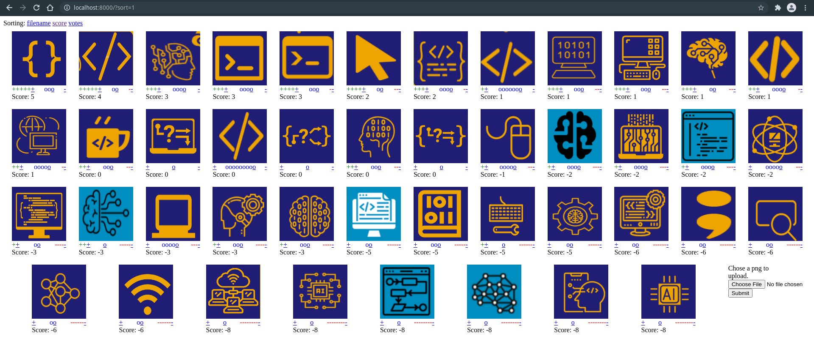

# Demo app for a fastapi voting gallery

Fully serversided, no JS required!

Storage in a yaml file, no db required!

Showcasing GET, POST, file upload, redirects, jinja2 templates.

Loads data from a google doc with a migration script in the migration file.

License: (Creative Commons 0, 1.0](https://creativecommons.org/publicdomain/zero/1.0/deed.de)

